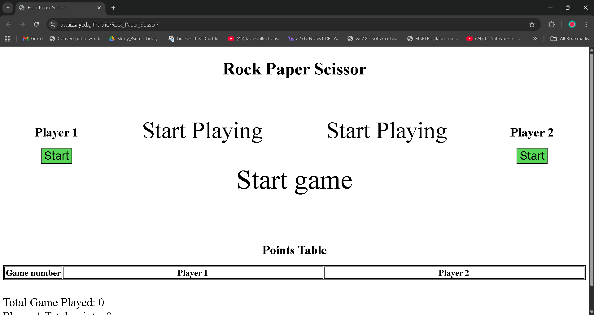
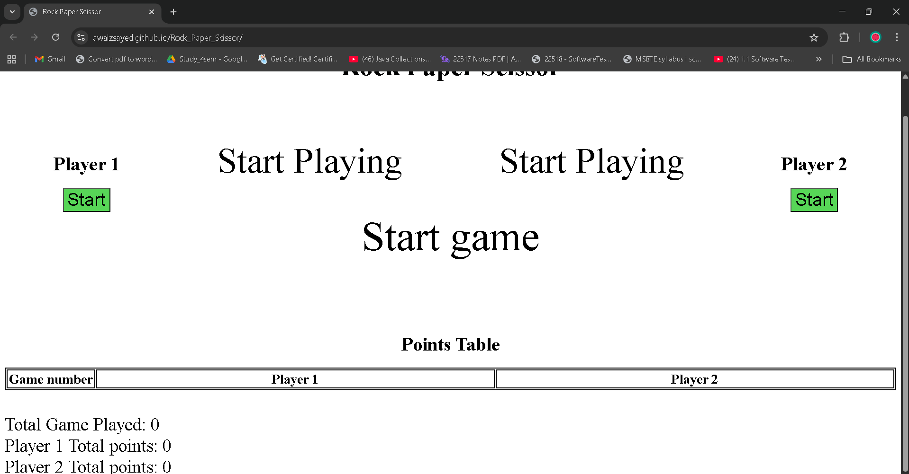
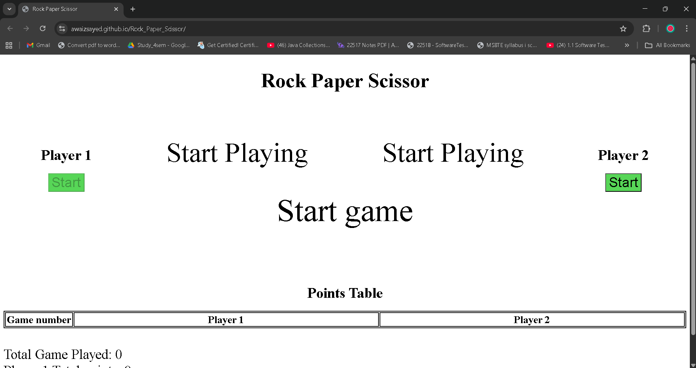
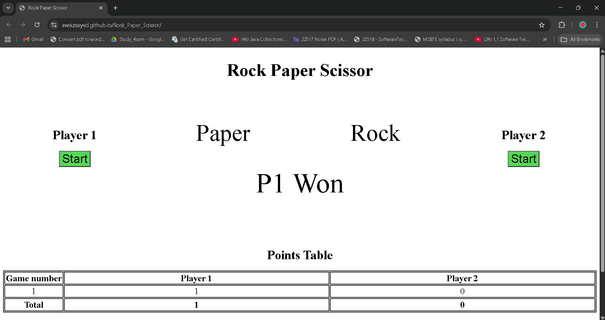
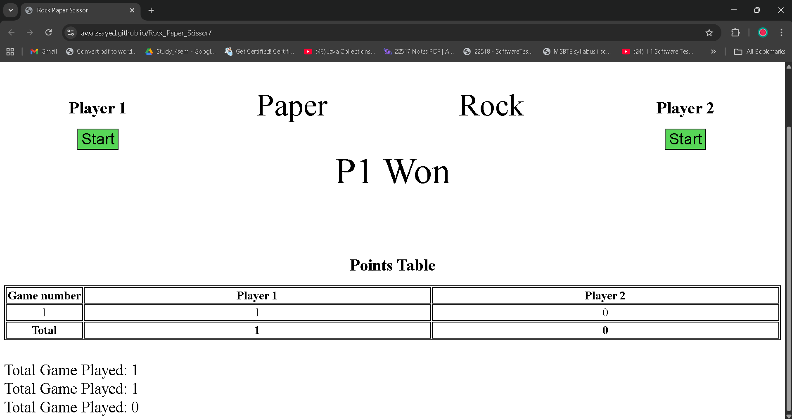

# Rock Paper Scissor

A simple browser-based Rock-Paper-Scissors game implemented in [HTML/CSS/JavaScript]. Two players can play locally, with a dynamic scoreboard that shows the total games played and each player's points.

## 🎮 Live Demo

Check out the live version here:  
[**Rock Paper Scissor**](https://awaizsayed.github.io/Rock_Paper_Scissor/)

---

## 🕹️ How to Play

1. **Start the Game**

   - Open the [Live Demo](https://awaizsayed.github.io/Rock_Paper_Scissor/).
   - Both players click their **Start** button.

2. **Make Your Choice**

   - Each player chooses one option:  
     ✊ Rock | ✋ Paper | ✌️ Scissors

3. **Game Rules**

   - Rock beats Scissors
   - Scissors beats Paper
   - Paper beats Rock
   - Same choice = Draw

4. **See Who Wins**

   - The winner of the round is displayed instantly.
   - The **scoreboard updates**:
     - Total Games Played
     - Player 1 Points
     - Player 2 Points

5. **Keep Playing**
   - Continue rounds as long as you want.
   - Scores accumulate so you can track progress.

---

## 📸 Game Preview

Here’s how the game looks:

### Start Screen

### Player Choices

Player One clicks on start button

As Player two clicks on start button game gets in action

### Scoreboard

---

## 🚀 Features

- Local **two-player gameplay** in the browser
- Real-time **scoreboard updates**
- Simple, responsive design

---
